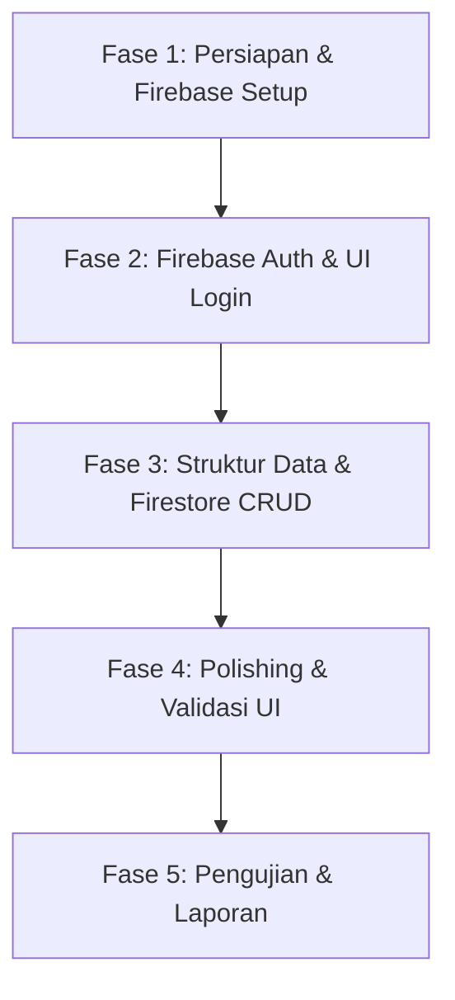

# Dokumen Kebutuhan (Requirements) & Fase Implementasi
## Aplikasi "JamMalam" - Jadwal Ronda dengan Firebase Auth & CRUD

Dokumen ini disusun untuk menjelaskan spesifikasi kebutuhan (requirements) dan tahapan/fase implementasi untuk tugas besar mata kuliah Pemrograman Mobile berupa aplikasi manajemen jadwal ronda malam (**JamMalam**).

---

## 1. Deskripsi Aplikasi
**JamMalam** adalah aplikasi mobile berbasis Flutter yang dirancang untuk mendigitalisasi dan memudahkan pengelolaan jadwal ronda malam di lingkungan RT/RW. Aplikasi ini memiliki fitur login/register menggunakan **Firebase Authentication** dan fitur **CRUD (Create, Read, Update, Delete)** untuk pengelolaan jadwal ronda yang disimpan di **Cloud Firestore**.

---

## 2. Kebutuhan Aplikasi (Requirements)

### A. Fitur Utama
1. **Autentikasi Pengguna (Firebase Auth)**
   - **Pendaftaran Akun (Register):** Pengguna (warga/admin) dapat mendaftar dengan Email & Password.
   - **Masuk (Login):** Pengguna dapat masuk ke aplikasi menggunakan akun yang terdaftar.
   - **Keluar (Logout):** Pengguna dapat keluar dengan aman.
   - **Persistence Session:** Pengguna yang sudah masuk tidak perlu login kembali saat membuka aplikasi berikutnya sebelum melakukan logout.

2. **Pengelolaan Jadwal Ronda (CRUD - Firestore)**
   - **Create (Tambah Jadwal):** Admin/Pengguna berwenang dapat menambahkan jadwal ronda baru (nama petugas, hari, tanggal, area/pos ronda).
   - **Read (Lihat Jadwal):** Pengguna dapat melihat daftar seluruh jadwal ronda, serta detail petugas untuk hari tertentu.
   - **Update (Edit Jadwal):** Admin dapat mengubah detail jadwal ronda (mengubah daftar petugas atau hari ronda).
   - **Delete (Hapus Jadwal):** Admin dapat menghapus jadwal ronda dari sistem.

3. **Peran Pengguna (Roles - Opsional/Sederhana)**
   - **Admin (Pengurus RT/RW):** Memiliki akses penuh untuk CRUD jadwal ronda.
   - **Warga (User biasa):** Hanya memiliki akses baca (Read) untuk melihat jadwal ronda dan mencarinya.

---

### B. Kebutuhan Non-Fungsional (Non-Functional Requirements)
* **Keamanan:** Autentikasi aman melalui SDK Firebase.
* **Ketersediaan Data:** Menggunakan Cloud Firestore untuk sinkronisasi data secara real-time dan offline support (bawaan Firebase).
* **Desain Antarmuka (UI):** Responsif, bertema gelap/terang modern (clean & premium look), dan mudah digunakan oleh warga dari berbagai usia.

---

## 3. Arsitektur & Teknologi

* **Frontend:** Flutter (Dart)
* **Backend / Database:** Cloud Firestore (Firebase)
* **Authentication:** Firebase Authentication
* **State Management:** Provider / Bloc / Simple State (setState untuk kesederhanaan tugas kuliah)

---

## 4. Fase Implementasi (Implementation Roadmap)



### **Fase 1: Persiapan & Konfigurasi**
* [x] Inisialisasi Firebase project di Firebase Console (dilakukan di Firebase Console).
* [x] Konfigurasi Flutter untuk Android (`android/app/build.gradle.kts` / `settings.gradle.kts` selesai diganti, silakan letakkan file `google-services.json` Anda di `android/app/`).
* [ ] Konfigurasi Flutter untuk iOS (jika diperlukan, `GoogleService-Info.plist`).
* [x] Menginstal dependency/package Flutter yang dibutuhkan di `pubspec.yaml` (firebase_core, firebase_auth, cloud_firestore).
* [x] Inisialisasi Firebase pada fungsi `main()` di `lib/main.dart`.

### **Fase 2: Autentikasi Pengguna**
* [ ] Membuat UI Halaman Login & Register dengan validasi input (email valid, password minimal 6 karakter).
* [ ] Membuat *Authentication Service* untuk membungkus fungsi `signInWithEmailAndPassword`, `createUserWithEmailAndPassword`, dan `signOut`.
* [ ] Mengimplementasikan *Auth State Wrapper* untuk mengarahkan pengguna secara otomatis ke Halaman Utama jika sudah login, atau ke Halaman Login jika belum.

### **Fase 3: Implementasi CRUD Jadwal Ronda**
* [ ] Menentukan skema data (Model Jadwal Ronda):
  ```json
  {
    "id": "string",
    "hari": "string",
    "tanggal": "timestamp",
    "area": "string",
    "petugas": ["nama_1", "nama_2", "nama_3"]
  }
  ```
* [ ] Membuat halaman Dashboard/Utama:
  * Menampilkan daftar jadwal ronda menggunakan `StreamBuilder` agar data ter-update secara real-time dari Firestore.
* [ ] Membuat form Tambah Jadwal Ronda (Input hari, tanggal, area, dan daftar petugas).
* [ ] Membuat form Edit Jadwal Ronda (Memuat data lama dan memperbaruinya di Firestore).
* [ ] Menambahkan tombol/aksi Hapus Jadwal dengan dialog konfirmasi agar tidak terhapus secara tidak sengaja.

### **Fase 4: Polishing UI & Penanganan Error**
* [ ] Menerapkan estetika premium: Warna tema yang harmonis (contoh: Navy, Dark Teal, atau Slate Blue), sudut membulat (*border radius*), serta *spacing* yang rapi.
* [ ] Menambahkan pesan error yang user-friendly (misal: "Email salah", "Password tidak cocok", atau "Koneksi internet bermasalah").
* [ ] Menambahkan *loading indicator* saat memproses login/register atau menyimpan data jadwal.

### **Fase 5: Pengujian & Penyelesaian Dokumen**
* [ ] Melakukan testing fungsionalitas CRUD secara menyeluruh.
* [ ] Menguji alur autentikasi (login, register, logout, persistence login).
* [ ] Menyusun tangkapan layar (screenshots) untuk lampiran laporan tugas besar.
