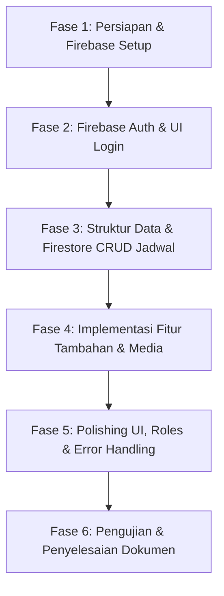

# Dokumen Kebutuhan (Requirements) & Fase Implementasi
## Aplikasi "JamMalam" - Jadwal Ronda dengan Firebase Auth & CRUD

Dokumen ini disusun untuk menjelaskan spesifikasi kebutuhan (requirements) dan tahapan/fase implementasi untuk tugas besar mata kuliah Pemrograman Mobile berupa aplikasi manajemen jadwal ronda malam (**JamMalam**).

---

## 1. Deskripsi Aplikasi
**JamMalam** adalah aplikasi mobile berbasis Flutter yang dirancang untuk mendigitalisasi dan memudahkan pengelolaan jadwal ronda malam di lingkungan RT/RW. Aplikasi ini memiliki fitur login/register menggunakan **Firebase Authentication** dan fitur **CRUD (Create, Read, Update, Delete)** untuk pengelolaan jadwal ronda yang disimpan di **Cloud Firestore**.

---

## 2. Kebutuhan Aplikasi (Requirements)

### A. Fitur Utama
1. **Autentikasi Pengguna (Firebase Auth)**
   - **Pendaftaran Akun (Register):** Pengguna (warga/admin) dapat mendaftar dengan Email & Password.
   - **Masuk (Login):** Pengguna dapat masuk ke aplikasi menggunakan akun yang terdaftar.
   - **Keluar (Logout):** Pengguna dapat keluar dengan aman.
   - **Persistence Session:** Pengguna yang sudah masuk tidak perlu login kembali saat membuka aplikasi berikutnya sebelum melakukan logout.

2. **Pengelolaan Jadwal Ronda (CRUD - Firestore)**
   - **Create (Tambah Jadwal):** Admin/Pengguna berwenang dapat menambahkan jadwal ronda baru (nama petugas, hari, tanggal, area/pos ronda).
   - **Read (Lihat Jadwal):** Pengguna dapat melihat daftar seluruh jadwal ronda, serta detail petugas untuk hari tertentu.
   - **Update (Edit Jadwal):** Admin dapat mengubah detail jadwal ronda (mengubah daftar petugas atau hari ronda).
   - **Delete (Hapus Jadwal):** Admin dapat menghapus jadwal ronda dari sistem.

3. **Peran Pengguna (Roles)**
   - **Admin (Pengurus RT/RW):** Memiliki akses penuh untuk CRUD jadwal ronda, menyetujui tukar jadwal, dan melihat semua laporan aktivitas/kejadian.
   - **Warga (User biasa):** Dapat melihat jadwal ronda, melakukan check-in presensi, membuat laporan kejadian/patroli, mengajukan tukar jadwal, serta mengakses kontak darurat & tombol panik.

4. **Absensi / Presensi Ronda (Check-in)**
   - **Check-in Kehadiran:** Pengguna yang sedang bertugas ronda dapat menekan tombol "Mulai Ronda" (Check-in) saat waktu ronda dimulai.
   - **Verifikasi Lokasi & Foto (Opsional):** Petugas melampirkan koordinat GPS atau foto selfie di pos ronda sebagai bukti kehadiran.
   
5. **Laporan Kejadian / Aktivitas Patroli (Patrol Log)**
   - **Tambah Laporan:** Petugas ronda dapat membuat laporan berkala atau insiden (misalnya: pintu gerbang aman, lampu mati, tindakan mencurigakan) selama berpatroli.
   - **Unggah Foto Kejadian:** Mengambil dan melampirkan foto kondisi/kejadian langsung dari kamera.
   - **Daftar Laporan:** Warga dan admin dapat melihat daftar laporan patroli secara real-time.

6. **Pengajuan Tukar Jadwal (Schedule Swap Request)**
   - **Request Swap:** Warga yang tidak bisa bertugas di hari yang dijadwalkan dapat mengajukan permohonan tukar jadwal.
   - **Konfirmasi Swap:** Warga lain dapat mengajukan diri untuk bertukar, yang kemudian akan memperbarui jadwal ronda setelah disetujui.

7. **Kontak Darurat (Emergency Contacts)**
   - **Daftar Nomor Penting:** Menampilkan daftar kontak darurat (Ambulans, Damkar, Polsek, Ketua RT/RW).
   - **Panggilan Langsung:** Tombol panggil cepat untuk langsung melakukan panggilan telepon.

8. **Tombol Panik (Panic Button)**
   - **Picu Alarm:** Tombol khusus untuk mengirimkan peringatan bahaya/darurat secara real-time ke semua warga.
   - **Alarm Suara:** Membunyikan suara sirene di HP pengguna yang menekan tombol.

9. **Notifikasi Pengingat (Reminder Notifications)**
   - **Pengingat Jadwal:** Mengirim notifikasi lokal/push pada sore hari sebelum tugas ronda dimulai agar warga bersiap.


---

### B. Kebutuhan Non-Fungsional (Non-Functional Requirements)
* **Keamanan:** Autentikasi aman melalui SDK Firebase.
* **Ketersediaan Data:** Menggunakan Cloud Firestore untuk sinkronisasi data secara real-time dan offline support (bawaan Firebase).
* **Desain Antarmuka (UI):** Responsif, bertema gelap/terang modern (clean & premium look), dan mudah digunakan oleh warga dari berbagai usia.

---

## 3. Arsitektur & Teknologi

* **Frontend:** Flutter (Dart)
* **Backend / Database:** Cloud Firestore & Firebase Storage
* **Authentication:** Firebase Authentication
* **State Management:** Provider / Bloc / Simple State (setState untuk kesederhanaan)
* **Dependency Tambahan:**
  - `geolocator` (untuk mendapatkan lokasi GPS presensi)
  - `image_picker` (untuk mengambil foto presensi & laporan)
  - `url_launcher` (untuk panggilan telepon darurat)
  - `audioplayers` atau `flutter_ringtone_player` (untuk alarm tombol panik)
  - `flutter_local_notifications` (untuk pengingat lokal)

---

## 4. Fase Implementasi (Implementation Roadmap)



### **Fase 1: Persiapan & Konfigurasi**
* [x] Inisialisasi Firebase project di Firebase Console (dilakukan di Firebase Console).
* [x] Konfigurasi Flutter untuk Android (`android/app/build.gradle.kts` / `settings.gradle.kts` selesai diganti, silakan letakkan file `google-services.json` Anda di `android/app/`).
* [ ] Konfigurasi Flutter untuk iOS (jika diperlukan, `GoogleService-Info.plist`).
* [x] Menginstal dependency/package Flutter yang dibutuhkan di `pubspec.yaml` (firebase_core, firebase_auth, cloud_firestore).
* [x] Inisialisasi Firebase pada fungsi `main()` di `lib/main.dart`.
* [ ] Menambahkan dependency tambahan (`geolocator`, `image_picker`, `url_launcher`, `audioplayers`, `flutter_local_notifications` dan `firebase_storage`).

### **Fase 2: Autentikasi Pengguna & Role Setup**
* [x] Membuat UI Halaman Login & Register dengan validasi input (email valid, password minimal 6 karakter).
* [x] Membuat *Authentication Service* untuk membungkus fungsi `signInWithEmailAndPassword`, `createUserWithEmailAndPassword`, dan `signOut`.
* [x] Mengimplementasikan *Auth State Wrapper* untuk mengarahkan pengguna secara otomatis ke Halaman Utama jika sudah login, atau ke Halaman Login jika belum.
* [x] Membuat koleksi `users` di Firestore untuk menyimpan role (`admin` / `warga`) dari masing-masing pengguna.

### **Fase 3: Struktur Data & Firestore CRUD Jadwal Ronda**
* [x] Menentukan skema data (Model Jadwal Ronda):
  ```json
  {
    "id": "string",
    "hari": "string",
    "tanggal": "timestamp",
    "area": "string",
    "petugas": ["nama_1", "nama_2", "nama_3"]
  }
  ```
* [x] Membuat halaman Dashboard/Utama:
  * Menampilkan daftar jadwal ronda menggunakan `StreamBuilder` agar data ter-update secara real-time dari Firestore.
* [x] Membuat form Tambah Jadwal Ronda (Input hari, tanggal, area, dan daftar petugas).
* [x] Membuat form Edit Jadwal Ronda (Memuat data lama dan memperbaruinya di Firestore).
* [x] Menambahkan tombol/aksi Hapus Jadwal dengan dialog konfirmasi agar tidak terhapus secara tidak sengaja.

### **Fase 4: Implementasi Fitur Tambahan & Media**
* [ ] **Absensi/Presensi Ronda:**
  * Membuat koleksi `presensi` di Firestore.
  * Implementasi tombol "Mulai Ronda" yang mendeteksi GPS koordinat dan mengambil foto selfie via `image_picker`, lalu mengunggahnya ke `Firebase Storage`.
* [ ] **Laporan Kejadian (Patrol Log):**
  * Membuat koleksi `laporan` di Firestore.
  * Implementasi form laporan kejadian (deskripsi teks & upload foto).
  * Membuat halaman daftar laporan patroli yang bisa dilihat oleh warga lain.
* [ ] **Tukar Jadwal (Schedule Swap):**
  * Membuat koleksi `swap_requests` di Firestore.
  * Membuat fitur ajukan permohonan swap dan tombol "Bantu Ronda" bagi warga lain.
* [ ] **Kontak Darurat & Panic Button:**
  * Membuat halaman Kontak Darurat yang terintegrasi dengan `url_launcher`.
  * Membuat tombol panik yang memicu alarm suara lokal dan mengirim data darurat ke Firestore untuk men-trigger alert real-time ke semua user yang sedang online.
* [ ] **Notifikasi Pengingat:**
  * Setup `flutter_local_notifications` untuk mengirim pengingat jadwal ronda terjadwal.

### **Fase 5: Polishing UI, Roles & Penanganan Error**
* [ ] Menerapkan estetika premium: Warna tema yang harmonis (contoh: Navy, Dark Teal, atau Slate Blue), sudut membulat (*border radius*), serta *spacing* yang rapi.
* [ ] Implementasi batasan akses UI berdasarkan Role (misalnya: tombol Tambah/Edit/Hapus Jadwal hanya muncul jika role = `admin`).
* [ ] Menambahkan pesan error yang user-friendly (misal: "Email salah", "Password tidak cocok", atau "Akses lokasi ditolak").
* [ ] Menambahkan *loading indicator* saat memproses login/register atau menyimpan data jadwal/presensi/laporan.

### **Fase 6: Pengujian & Penyelesaian Dokumen**
* [ ] Melakukan testing fungsionalitas CRUD & fitur tambahan secara menyeluruh.
* [ ] Menguji alur autentikasi (login, register, logout, persistence login, serta role checking).
* [ ] Menyusun tangkapan layar (screenshots) untuk lampiran laporan tugas besar.
